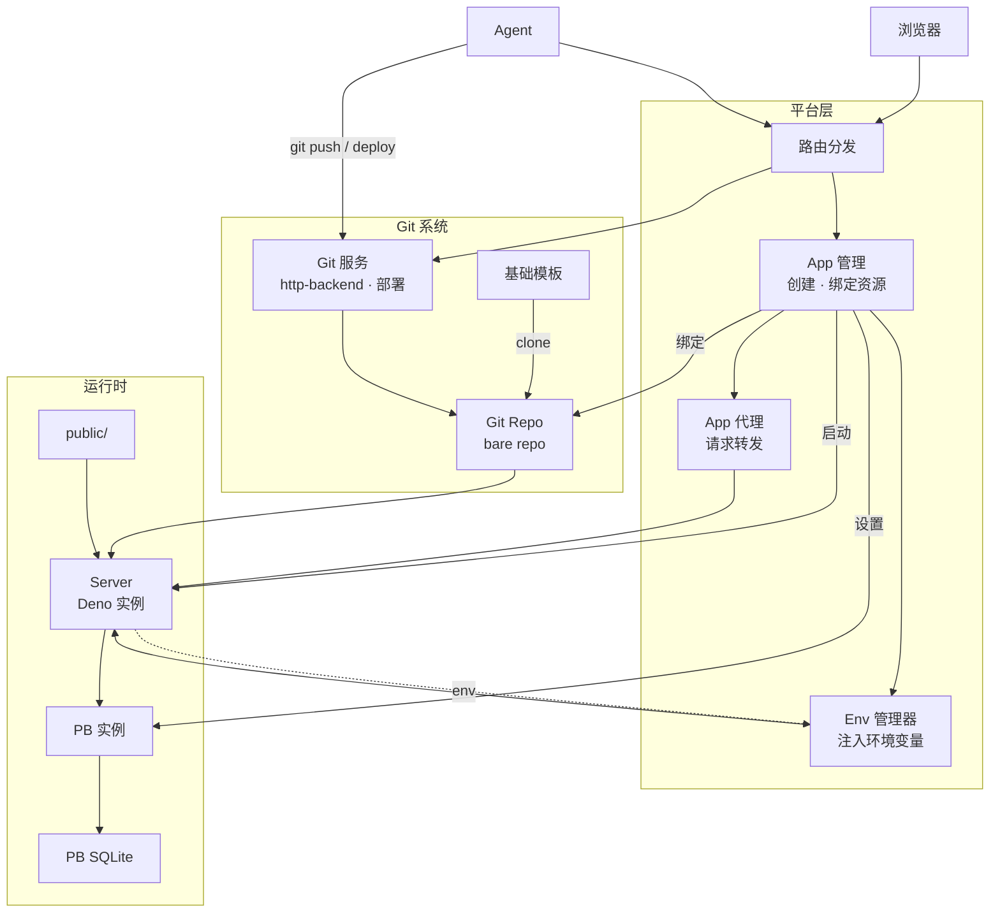

# Agent Sites 理想架构



## 设计概要

**每个 App 就是一个 Git 仓库。** 从基础模板 clone，Agent git push 代码，平台负责部署和运行。

### 三层结构

| 层 | 包含 | 职责 |
|----|------|------|
| **平台层** | Router · AppSvc · AppProxy · EnvMgr | 路由分发、App 生命周期、代理转发、环境变量管理 |
| **Git 系统** | Template · GitSvc · gitRepo | 代码来源、push/clone、部署 |
| **App** | PB 实例 · Server · DB · public/ | 一个站点实例，由仓库内容决定运行时行为 |

### 资源清单

| 资源 | 归属 | 说明 |
|------|------|------|
| **App** | —— | 站点实例，可以绑定 Git Repo、设置 PB、观察 Server |
| **Git Repo** | Git 系统 | App 绑定的 bare repo，唯一代码来源 |
| **PB** | App | App 设置的 PocketBase 实例，通过 EnvMgr 注入 runtime |
| **Server** | App | Deno 实例，运行默认模板或用户代码 |

### 流程

```
创建 App → 从模板 clone bare repo
    ↓
Agent git push / deploy → Git 系统处理
    ↓
Agent 设置 PB → EnvMgr 注入 env → Server
    ↓
Browser → AppProxy → Server → DB
```
