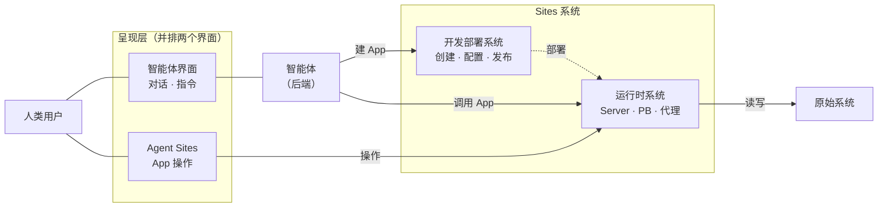
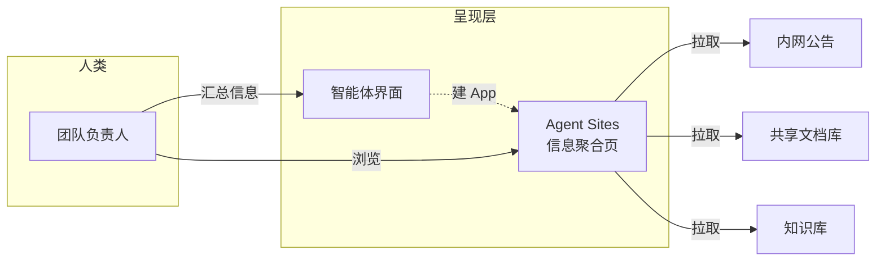
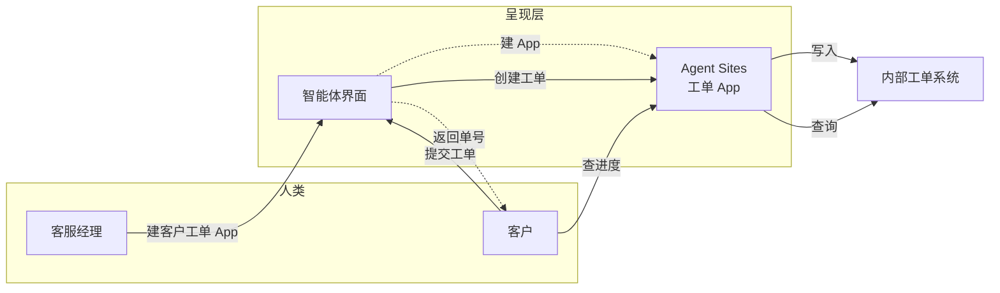
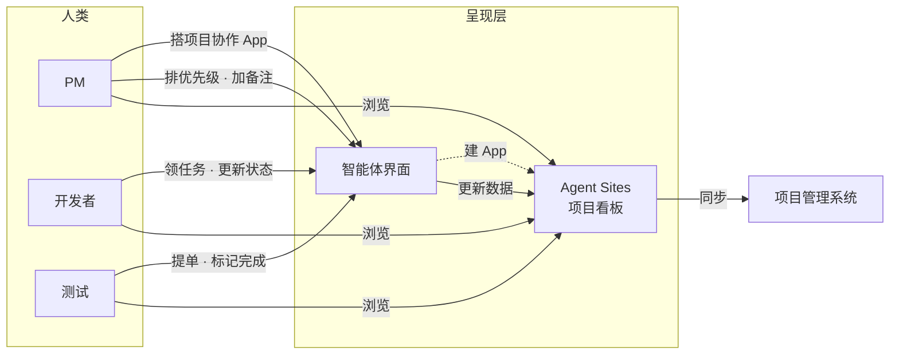
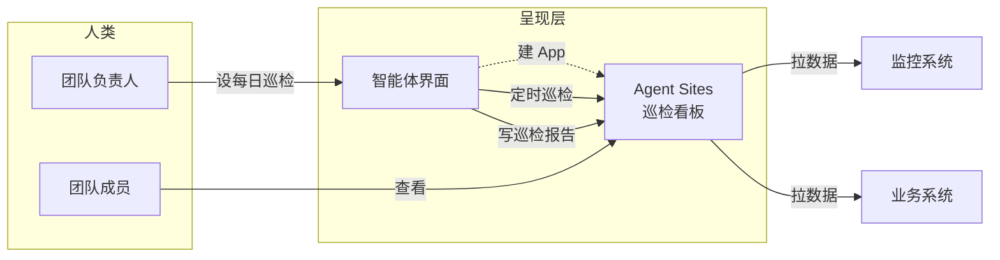
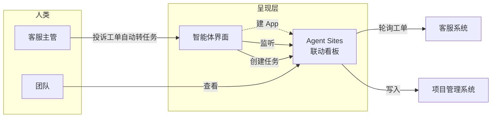

# Agent Sites 产品定位

## 四方关系



## 两个界面

| 界面 | 交互方式 | 背后的系统 |
|------|----------|------------|
| **智能体界面** | 对话、自然语言指令 | AI Agent → 开发部署系统 / 运行时系统 |
| **Agent Sites** | 点击、表单、数据查看 | 运行时系统 → 原始系统 |

两个界面**平级并排**。人类根据任务类型自然切换：想做新功能 → 对话界面；想看数据/做操作 → App 界面。

## 两条链路

```
建造链路：人类 → 智能体界面 → Agent → 开发部署系统 → 运行时系统 → 原始系统
使用链路：人类 → Agent Sites → 运行时系统 → 原始系统
```

- **建造链路**：人类通过对话让智能体建 App，建好后出现在Agent Sites上
- **使用链路**：人类直接在Agent Sites上操作 App，读写原始系统数据

## 用户场景

### 场景 A：信息聚合

> 团队信息散落在公司内网公告、共享文档库和知识库里，每次要翻三个地方才能找全。



### 场景 B：客户工单

> 客服部想让客户自助解决问题：客户用自然语言描述问题，智能体帮他录工单；客户想查进度时，打开页面输入单号就能看。



- **建造**：客服经理一句话建 App，不需要自己写代码或配接口
- **录单**：客户对智能体说自然语言，智能体理解问题→调 App 在原始系统创建工单→返回单号
- **查进度**：客户打开Agent Sites输入单号，App 校验身份后从原始系统拉取最新状态
- 外部客户全程不知道内部工单系统长什么样，也不触碰原始系统的任何凭证

### 场景 E：轻量项目协作

> 团队用的项目管理系统太重了，PM 想让智能体搭一个轻量版：日常操作对着智能体说就行，Agent Sites提供一个看板随时浏览。



- **建造**：PM 描述想要的协作方式（看板、任务流、角色权限），智能体直接生成 App + PB 数据模型
- **操作**：所有写操作走智能体界面——"把任务 X 分配给张三"、"这个需求优先级调高"、"标记迭代已完成"，智能体调 App 更新数据
- **看板**：Agent Sites作为全景视图——看任务分布、进度、瓶颈，拖动调整顺序、切换筛选视图
- 数据存在 App 自己的 PB 里，不依赖原始系统。团队日常操作说句话就行，不用填表单

### 场景 D：定时巡检

> 团队负责人想让智能体每天早上自动巡检关键系统，发现问题主动告警，不用每天自己登录去查。



- **建造**：团队负责人描述巡检规则——"每天早上查监控系统的错误率和业务系统的订单量，异常就标红"
- **定时执行**：智能体按设定频率自动调 App 拉数据、比对规则，生成巡检报告写入看板
- **人类使用**：团队成员打开 Agent Sites 看板就能看到每日巡检结果，异常项自动高亮
- 智能体不需要人类每次催促，到点自己干活。人类从"操作者"变成"监督者"

### 场景 F：事件联动

> 客服主管想让两个系统联动：每当客服系统收到投诉类工单，自动在项目管理里建一个待处理任务，省去人工转发。



- **建造**：客服主管描述联动规则——"客服系统里标为投诉的工单，自动在项目管理里生成一个 P1 任务"
- **事件驱动**：智能体持续监听客服系统的工单变化，发现投诉类工单→自动调 App 在项目管理系统创建对应任务
- **看板**：Agent Sites 上展示联动记录——哪些工单已转任务、哪些待处理、哪些异常
- 和 D 的区别：D 是定时触发（"每天早上"），F 是事件触发（"每当发生 X"）

## 一句话定义

**Sites 为智能体提供两个"界面"：一个给智能体操作（开发部署），一个给人类操作（运行时）。** 智能体负责把前者变成后者。
